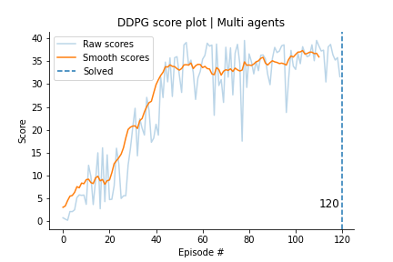

[//]: # (Image References)

[image1]: https://camo.githubusercontent.com/7ad5cdff66f7229c4e9822882b3c8e57960dca4e/68747470733a2f2f73332e616d617a6f6e6177732e636f6d2f766964656f2e756461636974792d646174612e636f6d2f746f706865722f323031382f4a756e652f35623165613737385f726561636865722f726561636865722e676966 "Trained Agent"

# RL Continuous Control

### Introduction

This project utilizes actor-critic deep reinforcement learning to train an agent to control double jointed arms with
goal of holding the tip of the arm inside a moving sphere (control zone).

![Trained Agent][image1]

A reward of +0.1 is given each frame the arms hand is inside the control zone, those generating the incentive for agent
to reach out and follow the moving sphere.

The state space has 33 dimensions and contains the position, rotation, velocity and angular velocities of the arm.
Given this information, the agent has to learn how to best select actions. Four continuous actions are available, 
corresponding position, rotation, velocity and angular velocities of the arm. The actions are represented by a vector
of four dimensions with value in the range of [-1, 1].

The task is episodic and in order to solve the environment, your agent must get an average score of +30 over 100 
consecutive episodes.
In the multi-agent environment the score for each episode is calculate as the mean score across agents for that 
episode.

In this project we solve the environment for both a single agent and a 20 agent environment using the deep deterministic
gradient policy (DDPG) method.

### Getting Started

1. Download the environment from one of the links below.  You need only select the environment that matches your operating system:
    - Linux: [click here](https://s3-us-west-1.amazonaws.com/udacity-drlnd/P1/Banana/Banana_Linux.zip)
    - Mac OSX: [click here](https://s3-us-west-1.amazonaws.com/udacity-drlnd/P1/Banana/Banana.app.zip)
    - Windows (32-bit): [click here](https://s3-us-west-1.amazonaws.com/udacity-drlnd/P1/Banana/Banana_Windows_x86.zip)
    - Windows (64-bit): [click here](https://s3-us-west-1.amazonaws.com/udacity-drlnd/P1/Banana/Banana_Windows_x86_64.zip)
    
    (_For Windows users_) Check out [this link](https://support.microsoft.com/en-us/help/827218/how-to-determine-whether-a-computer-is-running-a-32-bit-version-or-64) if you need help with determining if your computer is running a 32-bit version or 64-bit version of the Windows operating system.

    (_For AWS_) If you'd like to train the agent on AWS (and have not [enabled a virtual screen](https://github.com/Unity-Technologies/ml-agents/blob/master/docs/Training-on-Amazon-Web-Service.md)), then please use [this link](https://s3-us-west-1.amazonaws.com/udacity-drlnd/P1/Banana/Banana_Linux_NoVis.zip) to obtain the environment.

2. Place the file in the DRLND GitHub repository, in the 'navigation folder', and unzip (or decompress) the file. 

To correctly install all the dependencies that is needed please follow the udacity guide [here](https://github.com/udacity/deep-reinforcement-learning#dependencies).

If you have problems to get things to work there is a python folder included here that contain everything that is needed
in regards to get unity agent and such requirements as torch=0.4.0 to work. One than have the option to install it via
```
pip -q install ./python
```

To further install specific packages used for visualization and such install the packages in the requirements.txt file.
```
pip install -r requirements.txt
```

### Project

The different agents are trained in notebooks based on the code retrieved from the Udacity reinforcement learning nanodegree.

* `continuous_control_single_agent.ipynb` - training of DDPG agent in a single-agent environment
* `continuous_control_multi_agent.ipynb` - training of DDPG agent in a multi-agent environment

information about the environment and algorithm details are documented in report.pdf


The resources folder contains plots, training checkpoints and raw metrics used to evaluate the trainings.
* `metrics` - folder contain raw numpy metrics for the training as well as the episode when the agent reached its goal
* `plots` - folder contains individual plots for each agent (both with and without smoothing) as well as a comparison.
* `weights` - contains the fully trained weights of the agents.

## Results

The following is the score plot of a single agent who managed to solve the environment in 861 episodes.


The multi-agent environment containing distributing the traning to 20 agents manage to solve the environment in 120 episodes.



One flaw of the results is that they are based of individual runs without extensive hyperparameter search and not an 
aggregated measurement of multiple runs. Also worth to note is the lack of a experience replay buffer as per the
 original DDPG algorithm. 


For more extensicve discussion of the results and future work, see the [report](report.pdf).